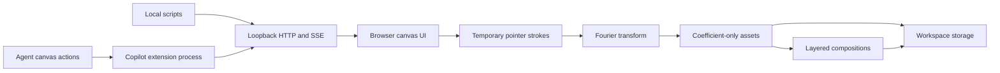

# Fourier Runtime Canvas

Fourier Runtime Canvas is an experimental GitHub Copilot canvas that treats a
drawn path as a temporary input, not a permanent artifact. It resamples the
path, computes complex Fourier coefficients, discards the source points, and
uses the retained frequencies to reconstruct, layer, keyframe, morph, animate,
and sonify the result at runtime.

The project explores whether frequency-domain assets can provide a compact,
agent-addressable representation for motion graphics and explanatory visuals.
Coefficient-only files may reduce file and context overhead compared with
retaining source paths plus rendered media, but this repository does not claim
token, storage, latency, or cost savings. Those outcomes need representative
benchmarks.


## What it does

The canvas has three connected workspaces. **Create** captures one or more
temporary pointer strokes and transforms them into `fourier-path/v1` assets.
**Compose & animate** layers those assets on a timeline with transform,
opacity, reveal, shape-morph, procedural-motion, and audio-cue settings.
**Signal runtime** visualizes live sine-series inputs and exposes a loopback
script bridge.

Runtime drawings contain coefficients shaped like
`{ frequency, amplitude, phase }`. They do not contain raster pixels or the
source pointer coordinates. Compositions reference those assets by ID and add
timing data, so the visible frame is reconstructed in the browser rather than
stored as an image.

## Architecture



The Node extension registers the `fourier-runtime-canvas` canvas and its agent
actions through `@github/copilot-sdk`. Each open canvas instance receives an
ephemeral HTTP server bound to `127.0.0.1` on an operating-system-assigned
port. The server owns validated state, persistence, history, and Server-Sent
Events. A self-contained HTML client renders the UI with Canvas 2D and Web
Audio APIs. Pure transformation, composition, and history modules stay
separate from the transport and renderer.

| Module | Responsibility |
| --- | --- |
| `extension.mjs` | Copilot actions, schemas, loopback HTTP/SSE, persistence, lifecycle |
| `fourier.mjs` | Path validation, normalization, resampling, DFT, coefficient selection |
| `composition.mjs` | Layer, keyframe, morph-target, motion, and audio normalization |
| `history.mjs` | Bounded semantic undo and redo snapshots |
| `renderer.mjs` | Interactive browser UI, reconstruction, animation, Web Audio |
| `security.mjs` | Capability checks, exact loopback request policy, CSP generation |
| `mutation-queue.mjs` | Per-workspace serialization for persistent mutations |

## Features

| Surface | Current capability |
| --- | --- |
| Drawing | Multi-stroke input, open or closed paths, configurable coefficient limits |
| Frequency assets | Normalized complex coefficients with no retained source points |
| Composition | Up to 64 layers and 128 keyframes per layer |
| Animation | Position, scale, rotation, opacity, reveal, easing, timeline playback |
| Morphing | Complex-coefficient interpolation between assets selected at keyframes |
| Motion | Optional procedural line movement that does not alter stored coefficients |
| Audio | Short Web Audio cues derived from strong stored frequency bins |
| Automation | Agent actions plus JSON HTTP endpoints and live SSE updates |
| Recovery | Persisted composition state with bounded undo and redo history |
| Accessibility | Keyboard movement, focus styles, responsive layout, reduced-motion handling |

## Install and run

The supported runtime is Node.js `^20.19.0` or `>=22.12.0`.

For repository development:

```powershell
git clone https://github.com/BrettReifs/fourier-runtime-canvas.git
Set-Location fourier-runtime-canvas
npm ci --prefix extensions/fourier-runtime-canvas
npm test
npm run validate
npm run package:check
```

For local extension discovery before marketplace publication, copy the
extension package into the user extension directory, install its locked
dependency, and restart Copilot CLI:

```powershell
$destination = "$HOME\.copilot\extensions\fourier-runtime-canvas"
New-Item -ItemType Directory -Force $destination | Out-Null
Copy-Item -Recurse -Force .\extensions\fourier-runtime-canvas\* $destination
npm ci --prefix $destination
```

The extension joins a Copilot-managed session, so running `node extension.mjs`
outside Copilot is not a standalone web-server mode. Once the matching
Awesome Copilot plugin is published, installation is expected to be:

```text
copilot plugin install fourier-runtime-canvas@awesome-copilot
```

Open the canvas by asking Copilot to open `fourier-runtime-canvas`. A useful
first flow is to draw a closed shape in Create, transform it with 32 to 64
components, switch to Compose & animate, and add a second shape as a morph
target.

## Agent actions

The extension exposes actions for series control, path transformation, asset
loading and inspection, composition editing, history, and bridge discovery.
For example, an agent can create a frequency-only asset:

```json
{
  "action": "transform_drawing",
  "input": {
    "name": "Triangle",
    "termLimit": 32,
    "strokes": [
      {
        "closed": true,
        "points": [
          { "x": 50, "y": 10 },
          { "x": 90, "y": 90 },
          { "x": 10, "y": 90 }
        ]
      }
    ],
    "runtime": {
      "duration": 4,
      "showEpicycles": true
    }
  }
}
```

The response is a `fourier-path/v1` object containing frequency, amplitude,
and phase values. `get_frequency_asset`, `list_frequency_assets`,
`load_frequency_asset`, `get_composition`, `update_composition`,
`undo_composition`, `redo_composition`, and `get_bridge_info` support the rest
of the workflow.

## Loopback HTTP API

Call the agent-only `get_bridge_info` action to discover the per-instance base
URL and random capability token. Ports and tokens are ephemeral and should
never be hard-coded. Every request needs the token in the
`X-Fourier-Capability` header. EventSource uses the same token in its protected
connection URL because the browser API cannot set custom headers.

| Method | Route | Purpose |
| --- | --- | --- |
| `GET` | `/api/state` | Current sine-series state |
| `POST` | `/api/series` | Patch the live sine series |
| `POST` | `/api/transform` | Transform temporary path points into coefficients |
| `GET`, `POST` | `/api/asset` | Read or replace the active frequency asset |
| `GET` | `/api/assets` | List stored frequency assets |
| `GET` | `/api/assets/:id` | Read one stored frequency asset |
| `GET`, `POST` | `/api/composition` | Read or replace the active composition |
| `GET` | `/api/history` | Read undo and redo availability |
| `POST` | `/api/history/undo` | Undo the last semantic composition change |
| `POST` | `/api/history/redo` | Redo the last undone composition change |
| `GET` | `/events` | Subscribe to series, asset, composition, and history SSE |
| `GET` | `/api/info` | Discover endpoints and current limits |

```powershell
# Copy these two values from the agent-only get_bridge_info action.
$baseUrl = "http://127.0.0.1:<port>/"
$capability = "<ephemeral capability token>"
$headers = @{ "X-Fourier-Capability" = $capability }
$bridge = Invoke-RestMethod -Uri "${baseUrl}api/info" -Headers $headers
$body = @{
  name = "Runtime output"
  fundamentalFrequency = 1
  coefficients = @(1, 0, 0.333, 0, 0.2)
} | ConvertTo-Json

Invoke-RestMethod -Method Post `
  -Uri $bridge.updateEndpoint `
  -Headers $headers `
  -ContentType "application/json" `
  -Body $body
```

## Privacy and storage

Raw pointer coordinates exist in the browser only while a drawing is being
edited and while its transform request is processed. After a successful
transform, the browser clears those points. The extension persists
coefficient assets under `fourier-assets/` and compositions plus history under
`fourier-compositions/` inside the active Copilot workspace.

The extension binds HTTP only to loopback and creates a cryptographically
random capability for each canvas instance. It also requires an exact loopback
Host, allows only absent or exact same-origin Origin headers, and applies a
nonce-based Content Security Policy to the iframe. The capability is not a
user credential, but it must still be treated as short-lived sensitive data.

The runtime makes no external network or CDN requests and initiates no
analytics or asset uploads. User-controlled labels are assigned with
`textContent`, not interpreted as HTML. Audio uses bounded Web Audio sine
oscillators with short, bounded gain envelopes.

The marketplace screenshot is the one intentional raster artifact. It
documents the UI and is not part of runtime drawing storage.

## Guardrails and current limits

Requests are capped at 1 MB and mutation routes require JSON. A transform
accepts at most 32 strokes, 4,096 points per stroke, 16,384 points in total,
4,096 resampled points, one million estimated DFT operations, and 2,048 output
coefficients. Assets accept at most 256 coefficients per stroke and 2,048 in
total. An active library accepts 128 assets and 64 MB of coefficient JSON.
Corrupt asset files are moved out of the active library into its quarantine
directory and reported through `/api/info`.

Compositions accept at most 64 layers, 128 keyframes per layer, 1,024
keyframes in total, 8,192 active scene coefficients, 256 active strokes, and a
300-second duration. Asset playback duration is limited to 60 seconds. The
renderer shares a 12,000-sample frame budget across visible layers and builds
morph frequency maps once per stroke rather than once per sample. Coordinates,
imported frequency bins, coefficient amplitudes, phases, and live-series
numeric values have explicit magnitude ceilings. History keeps 50 semantic
snapshots and is capped at 8 MB. Persistent writes are atomic and serialized
per workspace; composition revisions reject stale concurrent writes. SSE is
limited to eight clients per instance and disconnects clients that apply
backpressure.

This is an experiment, not a general vector editor, video renderer, audio
workstation, or compression benchmark. It currently has no collaborative
editing, export-to-video pipeline, Bézier authoring, GPU reconstruction,
cross-workspace asset catalog, user-identity authentication, or formal
compatibility guarantee for the two JSON formats. The DFT remains synchronous
inside its strict operation budget. Moving transforms to a worker thread is a
future option if measured workloads require larger budgets.

## Exploration directions

Engineering work should start with benchmarks: compare coefficient assets
against representative SVG paths, animation JSON, and raster/video outputs
for file size, reconstruction error, render time, and agent-context cost.
Other useful investigations include FFT-based transforms, adaptive term
selection by perceptual error, versioned format migrations, deterministic
asset hashes, off-main-thread rendering, richer interpolation, and optional
exporters that keep runtime storage coefficient-only.

Product and business exploration could test agent-generated technical
explainers, lightweight kinetic brand systems, procedural data stories, and
reusable motion primitives for developer tools. Any claim about lower cost or
smaller context should remain a hypothesis until a public benchmark and
workload methodology exist.

## Contribution status

This repository mirrors the intended
[`github/awesome-copilot`](https://github.com/github/awesome-copilot)
contribution layout directly. Extension source lives once under
`extensions/fourier-runtime-canvas/`; the matching manifest under
`plugins/fourier-runtime-canvas/` references that source. No `canvas.json` is
used. See [the upstream contribution notes](docs/awesome-copilot-contribution.md)
for the copy boundary, source references, and validation checklist.

The contribution has not yet been submitted upstream. Issues and pull requests
to this standalone repository are welcome under
[CONTRIBUTING.md](CONTRIBUTING.md). Security reports should follow
[SECURITY.md](SECURITY.md).

## License

MIT. See [LICENSE](LICENSE).
