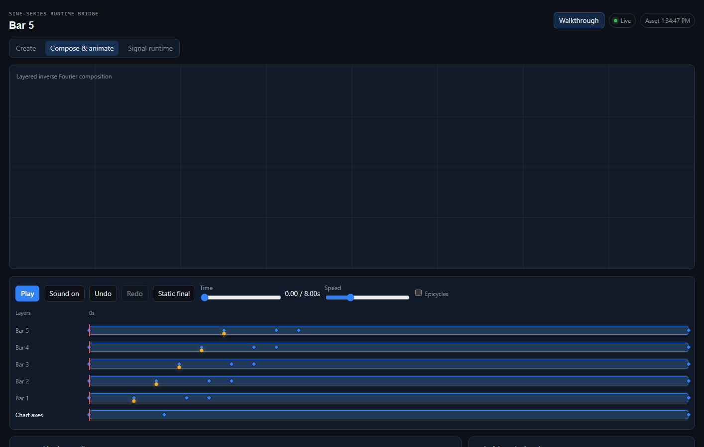
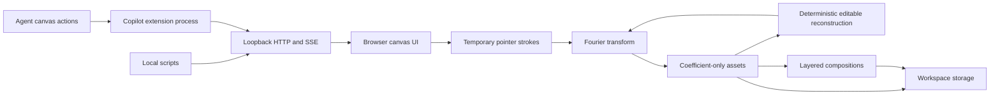

# Fourier Runtime Canvas

Fourier Runtime Canvas is a GitHub Copilot canvas for compact semantic
presentations and frequency-domain path animation. It renders text, KPI bars,
axes, and thresholds natively in Canvas 2D while retaining Fourier coefficients
for paths that benefit from spectral reconstruction.

The project explores whether semantic scene operations plus frequency-domain
assets can provide a compact, agent-addressable representation for motion
graphics and explanatory visuals.
Coefficient-only files may reduce file and context overhead compared with
retaining source paths plus rendered media, but this repository does not claim
token, storage, latency, or cost savings. Those outcomes need representative
benchmarks.



## What it does

The canvas opens directly into the active scene. Its full-bleed surface keeps
the scene name, play/pause, scrubber, time, Create, and Edit / Compose visible.
The layer timeline and field editors stay in a collapsed `See more` panel until
needed. On narrow screens that panel becomes a touch-sized bottom sheet.

**Create** is a session asset library and in-place element editor. It
deterministically reconstructs temporary control geometry from stored
coefficients, places that geometry beside the actual Fourier output, and saves
edits as a new revision under the existing asset ID. **Edit / Compose** combines
native semantic presentation layers with Fourier assets on one timeline.
Semantic scenes provide upright text, a shared chart
scale, aligned thresholds, explicit palettes, safe areas, responsive aspect
ratios, deterministic entry animation, accessible summaries, and synthesized
audio cues. Fourier layers retain transform, opacity, reveal, shape-morph,
procedural-motion, spectral-audio, and animated occlusion-matte settings.
**Learn** preserves the sine-series runtime as secondary education about how
frequency terms become paths rather than presenting it as a creation mode.

Runtime drawings contain coefficients shaped like
`{ frequency, amplitude, phase }`. They do not contain raster pixels or the
source pointer coordinates. Compositions reference those assets by ID and add
timing data, so the visible frame is reconstructed in the browser rather than
stored as an image.

## Architecture



The Node extension registers the `fourier-runtime-canvas` canvas and its agent
actions through `@github/copilot-sdk`. Each open canvas instance receives an
ephemeral HTTP server bound to `127.0.0.1` on an operating-system-assigned
port. The server owns validated state, persistence, history, and Server-Sent
Events. A self-contained HTML client renders the UI with Canvas 2D and Web
Audio APIs. Pure transformation, composition, and history modules stay
separate from the transport and renderer.

| Module | Responsibility |
| --- | --- |
| `extension.mjs` | Copilot actions, schemas, loopback HTTP/SSE, persistence, lifecycle |
| `fourier.mjs` | Path validation, normalization, resampling, DFT, coefficient selection |
| `asset-editor.mjs` | Deterministic coefficient reconstruction, control selection, safe edits, stable revision planning |
| `field-tutorials.mjs` | Typed field education registry, deterministic demo definitions, local frame cache |
| `composition.mjs` | Hybrid semantic/Fourier layer, keyframe, matte, motion, audio, and aggregate-limit normalization |
| `presentation.mjs` | Typed KPI creation and patching, compact summaries, and responsive layout math |
| `history.mjs` | Bounded semantic undo and redo snapshots |
| `renderer.mjs` | Interactive browser UI, reconstruction, animation, Web Audio |
| `security.mjs` | Capability checks, exact loopback request policy, CSP generation |
| `mutation-queue.mjs` | Per-workspace serialization for persistent mutations |

## Features

| Surface | Current capability |
| --- | --- |
| Creator | Session asset library, point/stroke selection, keyboard nudging, topology editing, side-by-side live preview |
| Frequency assets | Normalized complex coefficients, stable identity, revision conflict checks, bounded asset edit history |
| Composition | Up to 64 layers and 128 keyframes per layer |
| Semantic presentation | Native text, shared-scale KPI bars, axes, thresholds, safe areas, and explicit palettes |
| Responsive layout | Persisted 16:9, 4:3, or 9:16 scene fitted safely into wide and narrow viewports |
| Animation | Position, scale, rotation, opacity, reveal, easing, timeline playback |
| Morphing | Complex-coefficient interpolation between assets selected at keyframes |
| Occlusion | Animated, padded Fourier silhouettes mask selected lower-depth layers |
| Motion | Optional procedural line movement that does not alter stored coefficients |
| Audio | Short Web Audio cues derived from strong stored frequency bins |
| Automation | Agent actions plus JSON HTTP endpoints and live SSE updates |
| Recovery | Separate bounded undo and redo for composition changes and in-place asset revisions |
| Education | Accessible field info cards with cached local demos and a secondary Learn surface |
| Accessibility | Keyboard movement, 44px narrow-layout controls, focus return, responsive drawers, reduced-motion handling |

## Install and run

The supported runtime is Node.js `^20.19.0` or `>=22.12.0`.

For repository development:

```powershell
git clone https://github.com/BrettReifs/fourier-runtime-canvas.git
Set-Location fourier-runtime-canvas
npm ci --prefix extensions/fourier-runtime-canvas
npm test
npm run benchmark:validate
npm run benchmark:compare
npm run validate
npm run package:check
```

For local extension discovery before marketplace publication, copy the
extension package into the user extension directory, install its locked
dependency, and restart Copilot CLI:

```powershell
$destination = "$HOME\.copilot\extensions\fourier-runtime-canvas"
New-Item -ItemType Directory -Force $destination | Out-Null
Copy-Item -Recurse -Force .\extensions\fourier-runtime-canvas\* $destination
npm ci --prefix $destination
```

The extension joins a Copilot-managed session, so running `node extension.mjs`
outside Copilot is not a standalone web-server mode. Once the matching
Awesome Copilot plugin is published, installation is expected to be:

```text
copilot plugin install fourier-runtime-canvas@awesome-copilot
```

Open the canvas by asking Copilot to open `fourier-runtime-canvas`. An existing
composition opens directly as the scene. Press Play or scrub first, open
Edit / Compose for layers and keyframes, or open Create to revise an asset
without changing its ID. Learn contains the signal and Fourier fundamentals.

## Agent actions

The preferred presentation actions are compact and semantic:

| Action | Purpose | Response |
| --- | --- | --- |
| `create_kpi_presentation` | Create native text, bar-chart, axis, and optional threshold layers from a typed KPI spec | Revision, changed layer IDs/count, warnings, persisted byte counts |
| `patch_kpi_presentation` | Apply revision-bound title, value, order, palette, timing, emphasis, threshold, or audio deltas | Compact diff summary only |
| `sync_kpi_presentation` | Explicitly reconcile supported low-level edits into canonical KPI metadata and owned layers | Compact diff summary only |
| `get_scene_summary` | Inspect semantic metadata, active layer names/types, and artifact counts/bytes | Compact scene summary only |

These actions never return coefficient arrays or the full composition.
`patch_kpi_presentation` uses the same serialized queue, revision check, bounded
history, and atomic workspace-state write as low-level composition changes. A
semantic-only patch does not create or update files in `fourier-assets/`.

Presentation metadata stores a SHA-256 fingerprint of the deterministic title,
bar-chart, and threshold layers. The compact patch recomputes it inside the
workspace mutation queue. If a low-level edit changed an owned semantic layer,
the patch fails with `semantic_drift`, the current revision, and a compact
warning instead of overwriting that edit. `sync_kpi_presentation` accepts an
`expectedRevision`, derives supported title, values, scale, axis, threshold,
entry, emphasis, palette colors, and audio settings from the owned layers, then
rebuilds those layers canonically through the same history and atomic
persistence path. Fourier overlay changes are outside the fingerprint and do
not trigger drift.

The lower-level actions remain available for advanced path work.
`transform_drawing`, `load_frequency_asset`, `get_frequency_asset`,
`get_composition`, and `update_composition` operate on full Fourier assets or
the complete hybrid composition. For example:

```json
{
  "action": "transform_drawing",
  "input": {
    "name": "Triangle",
    "termLimit": 32,
    "strokes": [
      {
        "closed": true,
        "points": [
          { "x": 50, "y": 10 },
          { "x": 90, "y": 90 },
          { "x": 10, "y": 90 }
        ]
      }
    ],
    "runtime": {
      "duration": 4,
      "showEpicycles": true
    }
  }
}
```

The low-level response is a `fourier-path/v1` object containing frequency, amplitude,
and phase values. `get_frequency_asset`, `list_frequency_assets`,
`load_frequency_asset`, `get_composition`, `update_composition`,
`undo_composition`, `redo_composition`, and `get_bridge_info` support the rest
of the workflow.

### Scene-first Creator

Create lists the workspace assets once by stable ID. Selecting an asset
reconstructs a bounded control-point model from its coefficients and
`sampleCount`; it does not recover or persist the original pointer path. The
left canvas selects strokes and points. Pointer drag or arrow keys move selected
points, Shift increases the keyboard step, Delete removes safe selections, and
the closed-path control changes topology. The right canvas overlays the saved
revision and the current Fourier preview.

An exact closed circle is reduced further: when an asset contains only a DC
center term and one `+1` or `-1` harmonic, Create replaces the node editor with
center, radius, and phase controls. Preview and save keep the circle at exactly
two coefficients, so changing its size or reveal start cannot introduce
freeform sampling noise.

Pointer movement updates browser geometry and a non-persistent loopback preview.
Save sends one revision-bound update. An unchanged save is a no-op. A successful
save keeps `asset.id` and `createdAt`, increments `revision`, and therefore
updates every visible and matte layer that already references that ID. Asset
Undo and Redo use a separate bounded history. A stale expected revision returns
`stale_asset_revision` rather than overwriting another edit.

Each editable field receives its info button from `field-tutorials.mjs`. The
registry stores the title, plain-language purpose, use case, tradeoffs, and a
deterministic local mini-scene definition. Repeated cards reuse cached frames.
Reduced-motion users receive a static before/current comparison. Opening a card
does not pause or mutate the scene, create an asset, or write history.

### Animated occlusion mattes

A Fourier layer can hide selected scenery behind a filled coefficient-only
silhouette. `occludes.layerIds` selects explicit lower layers and
`occludes.zIndices` selects every lower layer at those depths. The optional
`matteAssetId` references a distinct closed silhouette; without it, the
layer's animated visual asset is used. `mattePadding` expands the mask in CSS
pixels, defaults to `3` to prevent line leakage, and accepts values from `0`
through `16`.

Keyframes may override `matteAssetId`. The renderer interpolates consecutive
matte assets by stroke index and frequency, matching the owning layer's
transform, easing, reveal, opacity, and procedural motion. Use matching stroke
topology across matte assets for the cleanest transition.

```json
{
  "id": "walking-stage",
  "format": "fourier-composition/v1",
  "revision": 0,
  "duration": 8,
  "layers": [
    {
      "id": "scenery",
      "assetId": "forest-lines",
      "zIndex": 0,
      "keyframes": []
    },
    {
      "id": "walker",
      "assetId": "walker-lines",
      "matteAssetId": "walker-silhouette",
      "mattePadding": 3,
      "occludes": {
        "layerIds": ["scenery"],
        "zIndices": []
      },
      "zIndex": 2,
      "keyframes": [
        {
          "time": 0,
          "x": -0.8,
          "reveal": 1
        },
        {
          "time": 8,
          "x": 0.8,
          "reveal": 1
        }
      ]
    }
  ]
}
```

The named asset IDs in this example are placeholders for assets already loaded
into the active workspace.

### Grouped keyframe editing

Click a diamond to select one keyframe. Ctrl-click or Cmd-click toggles
individual keyframes, including keyframes on different layers. Shift-click
selects a contiguous range only within the anchor keyframe's layer; a
cross-layer Shift-click starts a new single selection. Mixed fields render
blank with a `Mixed` placeholder. Entering a value updates that field across
the selection while untouched mixed fields remain unchanged. For grouped
timing, Time / group start moves the earliest selected keyframe to the entered
time and preserves the spacing between selected keyframes.

Drag any diamond horizontally to select and retime it. Dragging any member of
an existing multi-selection moves the full group across layers while preserving
relative spacing. Drag activation pauses playback. The preview snaps to a
`0.01s` grid; hold Alt or Option for free movement. Timeline bounds and adjacent
unselected keyframes constrain the group, so a drag cannot leave the
composition or cross another keyframe.
Pointer movement only updates ghosts and the delta readout. Releasing commits
one history entry; Escape or pointer cancellation restores the original times.
Mouse, touch, and pen use the same pointer-capture path.

With a keyframe button focused, ArrowLeft and ArrowRight retime the current
selection by `0.01s`. Hold Shift for a `0.10s` step. Each key press commits one
undoable composition update.

Click empty track space or press Escape to clear selection. Delete or Backspace,
or the visible Delete button, removes the selected keyframes while retaining at
least one keyframe per Fourier layer. Each grouped save or deletion is one
composition-history change and can be undone with Ctrl/Cmd+Z.

## Loopback HTTP API

Call the agent-only `get_bridge_info` action to discover the per-instance base
URL and random capability token. Ports and tokens are ephemeral and should
never be hard-coded. Every request needs the token in the
`X-Fourier-Capability` header. EventSource uses the same token in its protected
connection URL because the browser API cannot set custom headers.

| Method | Route | Purpose |
| --- | --- | --- |
| `GET` | `/api/state` | Current sine-series state |
| `POST` | `/api/series` | Patch the live sine series |
| `POST` | `/api/transform` | Transform temporary path points into coefficients |
| `GET`, `POST` | `/api/asset` | Read or replace the active frequency asset |
| `GET` | `/api/assets` | List stored frequency assets |
| `GET` | `/api/assets/:id` | Read one stored frequency asset |
| `POST` | `/api/assets/:id/preview` | Transform reconstructed points for preview without persistence or revision changes |
| `PUT` | `/api/assets/:id` | Atomically update an existing asset with `expectedRevision` while retaining its ID |
| `GET` | `/api/assets/:id/history` | Read asset edit Undo/Redo availability |
| `POST` | `/api/assets/:id/undo` | Undo one asset edit with an expected revision |
| `POST` | `/api/assets/:id/redo` | Redo one asset edit with an expected revision |
| `GET`, `POST` | `/api/composition` | Read or replace the active composition |
| `GET` | `/api/history` | Read undo and redo availability |
| `POST` | `/api/history/undo` | Undo the last semantic composition change |
| `POST` | `/api/history/redo` | Redo the last undone composition change |
| `GET` | `/events` | Subscribe to series, asset, composition, and history SSE |
| `GET` | `/api/info` | Discover endpoints and current limits |

```powershell
# Copy these two values from the agent-only get_bridge_info action.
$baseUrl = "http://127.0.0.1:<port>/"
$capability = "<ephemeral capability token>"
$headers = @{ "X-Fourier-Capability" = $capability }
$bridge = Invoke-RestMethod -Uri "${baseUrl}api/info" -Headers $headers
$body = @{
  name = "Runtime output"
  fundamentalFrequency = 1
  coefficients = @(1, 0, 0.333, 0, 0.2)
} | ConvertTo-Json

Invoke-RestMethod -Method Post `
  -Uri $bridge.updateEndpoint `
  -Headers $headers `
  -ContentType "application/json" `
  -Body $body
```

## Privacy and storage

Raw pointer coordinates and coefficient-derived Creator control points exist
only while an edit or transform request is processed. Preview and update
requests may carry those temporary points over the authenticated loopback
connection, but the extension persists
coefficient assets under `fourier-assets/` and hybrid compositions plus history
under `fourier-compositions/` inside the active Copilot workspace. Semantic
layers are composition data and do not create frequency asset files.

The extension binds HTTP only to loopback and creates a cryptographically
random capability for each canvas instance. It also requires an exact loopback
Host, allows only absent or exact same-origin Origin headers, and applies a
nonce-based Content Security Policy to the iframe. The capability is not a
user credential, but it must still be treated as short-lived sensitive data.

The runtime makes no external network or CDN requests and initiates no
analytics or asset uploads. User-controlled labels are assigned with
`textContent`, not interpreted as HTML. Audio uses bounded Web Audio sine
oscillators with short, bounded gain envelopes.

The marketplace screenshot is the one intentional raster artifact. It
documents the UI and is not part of runtime drawing storage.

## Guardrails and current limits

Requests are capped at 1 MB and mutation routes require JSON. A transform
accepts at most 32 strokes, 4,096 points per stroke, 16,384 points in total,
4,096 resampled points, one million estimated DFT operations, and 2,048 output
coefficients. Assets accept at most 256 coefficients per stroke and 2,048 in
total. An active library accepts 128 assets and 64 MB of coefficient JSON.
Corrupt asset files are moved out of the active library into its quarantine
directory and reported through `/api/info`.

Compositions accept at most 64 layers, 128 keyframes per layer, 1,024
keyframes in total, 8,192 active scene coefficients, 256 active strokes, and a
300-second duration. KPI presentations accept at most 32 values and 2,048
semantic text characters in aggregate. Asset playback duration is limited to 60 seconds. The
scene budgets include distinct matte morph assets. The renderer shares a
12,000-sample frame budget across visible layers and builds
morph frequency maps once per stroke rather than once per sample. Coordinates,
imported frequency bins, coefficient amplitudes, phases, and live-series
numeric values have explicit magnitude ceilings. Composition history keeps 50
semantic snapshots. Each asset keeps up to eight edit snapshots, with all
workspace history capped at 8 MB. Persistent writes are atomic and serialized
per workspace; composition and asset revisions reject stale concurrent writes. SSE is
limited to eight clients per instance and disconnects clients that apply
backpressure.

This is an experiment, not a general vector editor, video renderer, audio
workstation, or compression benchmark. It currently has no collaborative
editing, export-to-video pipeline, Bézier handles, GPU reconstruction,
cross-workspace asset catalog, user-identity authentication, or formal
compatibility guarantee for the two JSON formats. The DFT remains synchronous
inside its strict operation budget. Moving transforms to a worker thread is a
future option if measured workloads require larger budgets.

## Exploration directions

Engineering work should start with benchmarks: compare semantic actions and coefficient assets
against representative SVG paths, animation JSON, and raster/video outputs
for file size, reconstruction error, render time, and agent-context cost.
Other useful investigations include FFT-based transforms, adaptive term
selection by perceptual error, versioned format migrations, deterministic
asset hashes, off-main-thread rendering, richer interpolation, and optional
exporters that keep runtime storage coefficient-only.

Product and business exploration could test agent-generated technical
explainers, lightweight kinetic brand systems, procedural data stories, and
reusable motion primitives for developer tools. Any claim about lower cost or
smaller context should remain a hypothesis until a public benchmark and
workload methodology exist.

The current semantic-layer hypothesis and the workload-specific pilot evidence
are documented in
[docs/semantic-presentation-benchmark.md](docs/semantic-presentation-benchmark.md).

## Experiment harness

The [`benchmarks/`](benchmarks/README.md) directory contains fixed datasets,
prompts, acceptance criteria, pilot telemetry, and dependency-free comparison
tools. It is separate from the runtime package so experiments can evolve
without changing the extension under test.

Run `npm run benchmark:validate` to check dataset limits and result schemas.
Run `npm run benchmark:compare` to print the pilot creation and revision
comparison.

## Contribution status

This repository mirrors the intended
[`github/awesome-copilot`](https://github.com/github/awesome-copilot)
contribution layout directly. Extension source lives once under
`extensions/fourier-runtime-canvas/`; the matching manifest under
`plugins/fourier-runtime-canvas/` references that source. No `canvas.json` is
used. See [the upstream contribution notes](docs/awesome-copilot-contribution.md)
for the copy boundary, source references, and validation checklist.

The contribution has not yet been submitted upstream. Issues and pull requests
to this standalone repository are welcome under
[CONTRIBUTING.md](CONTRIBUTING.md). Security reports should follow
[SECURITY.md](SECURITY.md).

## License

MIT. See [LICENSE](LICENSE).
